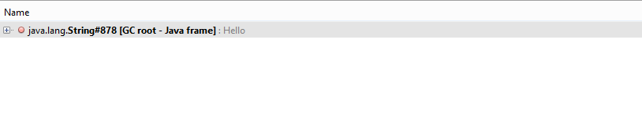
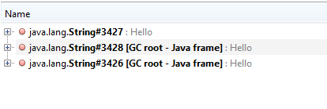

*"What's the difference between a string literal and a new String Object in Java?"*

This is a common question every Java programmer has come across in their programming life.

To answer in short, the literals are stored in a special memory area in the heap called Stringpool, and each String value is unique in the pool.  
So irrespective of one or more declarations of variables with the same String value in the code, only one object will be created in the pool.  
Whereas the new operator will create a different object each time we invoke it, even if the String value is the same.

While we can verify this programmatically by object comparison leveraging the hashcode, I was curious to verify this from the memory perspective.  
So I quickly created the below snippet of code:

```
public static void main(String[] args) throws InterruptedException {
    String wordOne = "Hello";
    String wordTwo = "Hello";
    Thread.sleep(100000);
}
```

The sleep statement was created to just have enough time to capture the heap before it terminates.

While the code was executing, we fired up VisualVM to capture the heap memory state of the process.

VisualVM is a free piece of software that can be used to create heap dumps (and many more) and also inspect them.

Once the dump was created, I ran the below OQL query to filter out the specific instance I was interested in.

```
select s from java.lang.String s where s.toString().equals("Hello");
```

It gave me only one instance of String class, indicating both variables are pointing to the same object in memory. (Figure 1)

<figure>
  
<figcaption>Figure 1: Only one reference of the String object with reference ID 808 and with value "Hello"
</figcaption>
</figure>

Now we executed the below code:
```
public static void main(String[] args) throws InterruptedException {
    String wordOne = new String("Hello");
    String wordTwo = new String("Hello");
    Thread.sleep(100000);
}
```

This gave me three instances in the result set with different object IDs, as seen in the snapshot. (Figure 2)


<figure>
    
    <figcaption>Figure 2: Three references of the String object with value "Hello"</figcaption>
</figure>

Now you may ask, *Why three IDs? Why was it not two as per the expectation?*

Because when we initialized the String object, we passed a literal value into the constructor, 
and this literal was stored in the stringpool as an object.  
Hence, three String objects.

This shows that the literal values are reused and the string objects are created each time the new operator is used.

It was fun experimenting with the theory using heapdump, and I urge everyone to explore this as well.

Keep practicing and keep growing.  
Thank you everyone.